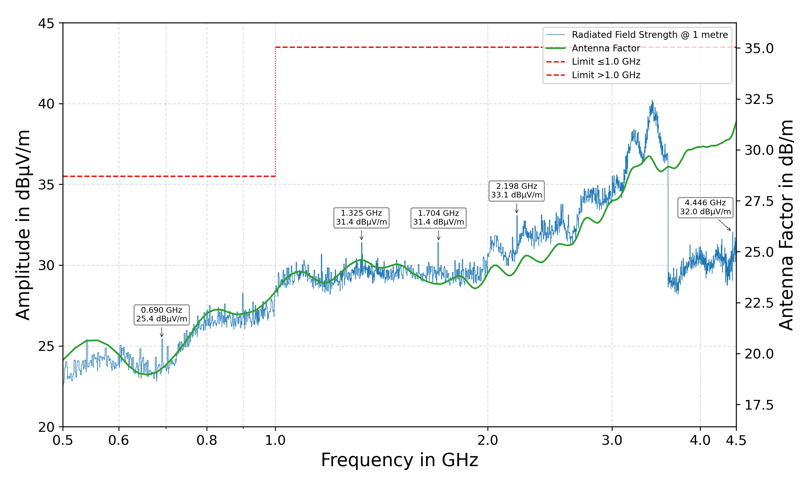
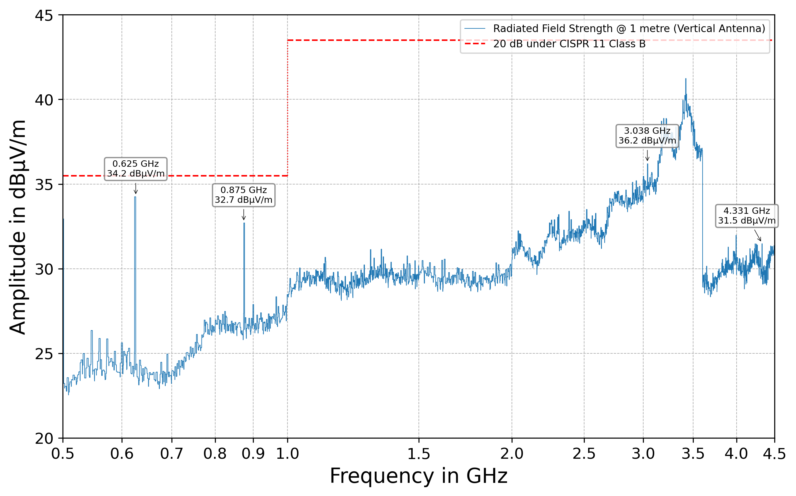

# RF-Positioning-System

A cost-effective 2-axis RF positioning system for characterizing antenna directionality in azimuth and elevation, developed as a bachelor project at the EMES chair at the University of Freiburg. Both axes rotate independently around a fixed centre of rotation, controlled by an ESP32 over a standard [SCPI](https://en.wikipedia.org/wiki/Standard_Commands_for_Programmable_Instruments) interface over Ethernet or USB.

  

## Key Specifications

| Parameter | Value |
|---|---|
| Positioning range | 360° independent rotation, azimuth and elevation |
| Positioning accuracy | 1.0° |
| Positioning speed | 0.1°/s – 180°/s |
| Frequency range | 600 MHz – 6 GHz |
| Payload | 500 g |
| DUT height above base | 1.0 m |
| Base footprint | 40 cm × 40 cm |
| Total weight | ~20 kg |
| Communication | USB, Ethernet (SCPI) |
| Power supply | 12 V DC |

## Measured Performance

Repeatability of both rotation axes, measured with a motion-capture system:

  
  

Radiated emissions were measured to confirm the system doesn't interfere with the antenna under test. The antenna factor of the measurement antenna was calibrated against the chamber's noise floor, and the fully assembled, enclosed system was then measured against 20 dB under the CISPR 11 Class B radiated emissions limit:

  
  

## Hardware

The controller is a custom PCB (KiCad project in [`Electrical/Controller`](Electrical/Controller)) built around an ESP32, driving two TMC2209 stepper drivers over UART. The mechanical design was done in Autodesk Fusion 360; the full CAD model is available in the [Fusion 360 online viewer](https://a360.co/42XAUax).

## Software

The firmware is written in C++ using the Arduino framework in PlatformIO (see [`Code/RF-Positioning-System`](Code/RF-Positioning-System)), and exposes a standards-compliant SCPI command set over Ethernet and USB — see that folder's [readme](Code/RF-Positioning-System/readme.md) for the full command reference and a quick-start example.

Firmware documentation is generated with Doxygen and published [here](https://heinekamp.github.io/RF-Positioning-System/index.html). If the following badge is green, it's up to date: .

## Documentation

The [Service Manual](Documentation/manual/ServiceManual.pdf) covers the system's theory of operation, the full SCPI interface, and maintenance/component-replacement procedures.
