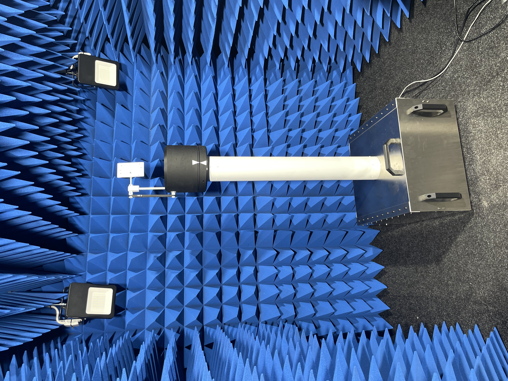
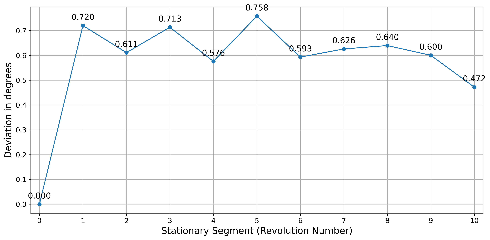
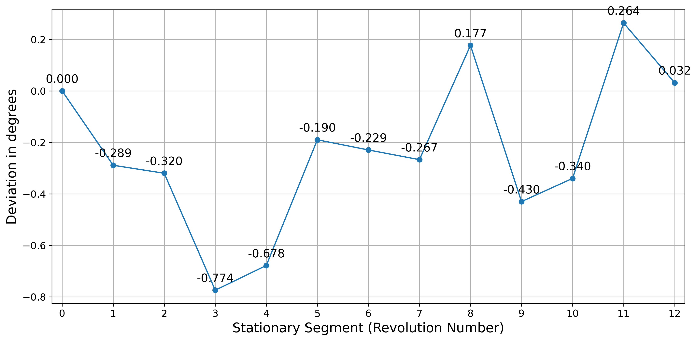
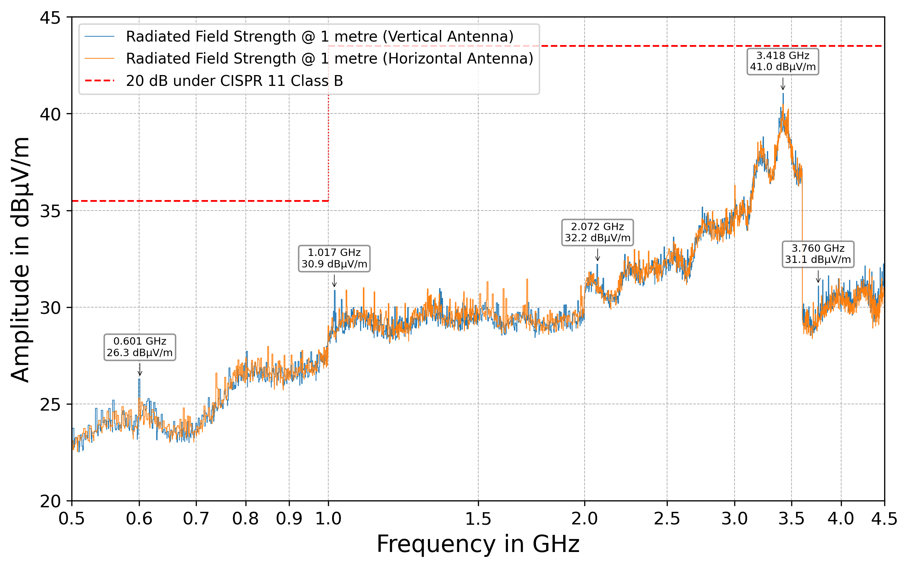
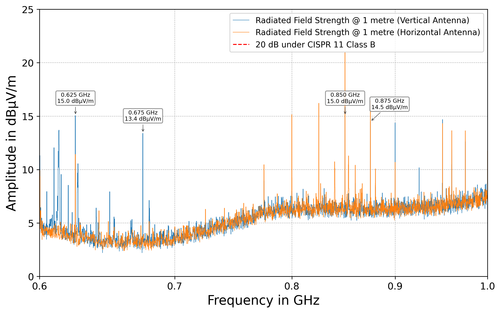

# RF-Positioning-System

A cost-effective 2-axis RF positioning system for characterizing antenna directionality in azimuth and elevation, developed as a bachelor project at the EMES chair at the University of Freiburg. Both axes rotate independently around a fixed centre of rotation, controlled by an ESP32 over a standard [SCPI](https://en.wikipedia.org/wiki/Standard_Commands_for_Programmable_Instruments) interface over Ethernet or USB.

  

## Key Specifications

| Parameter | Value |
|---|---|
| Positioning range | 360° independent rotation, azimuth and elevation |
| Positioning accuracy | 1.0° |
| Positioning speed | 0.1°/s – 180°/s |
| Frequency range | 600 MHz – 6 GHz |
| Payload | 500 g |
| DUT height above base | 1.0 m |
| Base footprint | 40 cm × 40 cm |
| Total weight | ~20 kg |
| Communication | USB, Ethernet (SCPI) |
| Power supply | 12 V DC |

## Measured Performance

Repeatability of both rotation axes, measured with a motion-capture system across 10 repeated full revolutions:

<table>
<tr>
<td width="50%"></td>
<td width="50%"></td>
</tr>
<tr>
<td>Azimuth positioning deviation from the commanded angle, measured after each of 10 repeated full revolutions.</td>
<td>Elevation positioning deviation from the commanded angle, measured the same way.</td>
</tr>
</table>

Radiated emissions of the fully assembled, enclosed system were measured with the Ethernet link forced to 10&nbsp;Mbit/s, against 20 dB under the CISPR 11 Class B radiated emissions limit:

<table>
<tr>
<td width="50%"></td>
<td width="50%"></td>
</tr>
<tr>
<td>Radiated field strength from 0.5–4.5 GHz, vertical and horizontal antenna polarization, against the CISPR 11 Class B limit.</td>
<td>Detail view of the 0.6–1.0 GHz band from the same measurement — individual emission peaks all remain more than 20 dB below the compliance limit shown at left.</td>
</tr>
</table>

## Hardware

The controller is a custom PCB (KiCad project in [`Electrical/Controller`](Electrical/Controller)) built around an ESP32, driving two TMC2209 stepper drivers over UART. The mechanical design was done in Autodesk Fusion 360; the full CAD model is available in the [Fusion 360 online viewer](https://a360.co/42XAUax).

## Software

The firmware is written in C++ using the Arduino framework in PlatformIO (see [`Code/RF-Positioning-System`](Code/RF-Positioning-System)), and exposes a standards-compliant SCPI command set over Ethernet and USB — see that folder's [readme](Code/RF-Positioning-System/readme.md) for the full command reference and a quick-start example.

Firmware documentation is generated with Doxygen and published [here](https://heinekamp.github.io/RF-Positioning-System/index.html). If the following badge is green, it's up to date: .

## Documentation

The [Service Manual](Documentation/manual/ServiceManual.pdf) covers the system's theory of operation, the full SCPI interface, and maintenance/component-replacement procedures.
